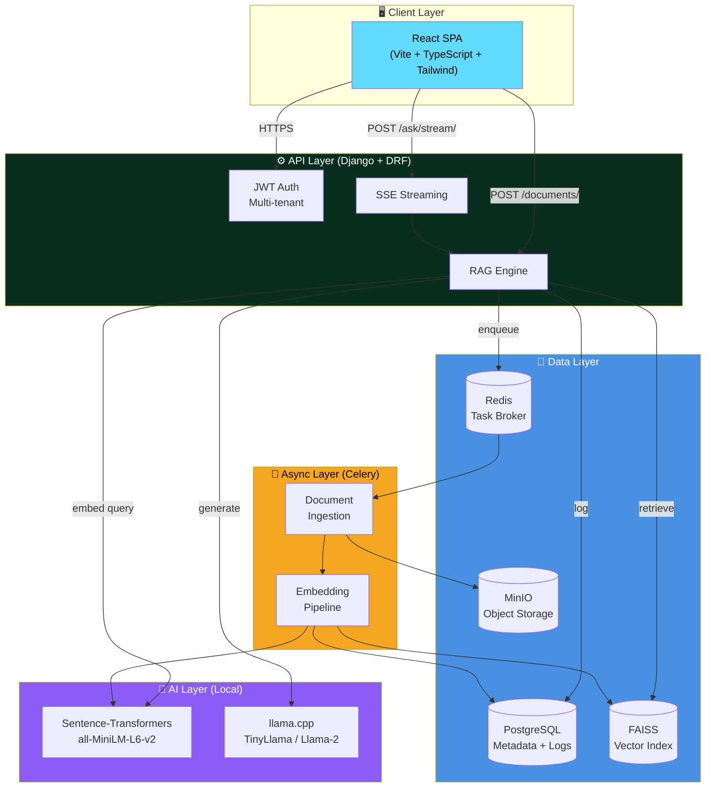

<div align="center">

# 🏢 Local Business Assistant

**Grounded RAG for small businesses — self-hosted, privacy-first, cited end-to-end.**

[](https://python.org)
[](https://djangoproject.com)
[](https://react.dev)
[](https://typescriptlang.org)
[](https://docker.com)
[](LICENSE)

[Features](#-features) · [Architecture](#-architecture) · [Quick Start](#-quick-start) · [API](#-api-reference) · [Screenshots](#-screenshots)

</div>

---

## 📖 What It Does

**Local Business Assistant** ingests a small business's documents — PDFs, manuals, policies, invoices — indexes them into a semantic vector store, and exposes RAG endpoints so staff and customers get **fast, grounded answers**, **auto-generated proposals**, and **citeable summaries**.

Every answer **links back to the exact passage** it came from. No hallucinations. No cloud APIs. Your data never leaves your servers.

### Why It Matters

| Problem | How We Solve It |
|---|---|
| Staff waste 20–40 min per proposal | AI drafts from your real service manual — 2 min |
| Customer questions get vague answers | Every reply cites the source document |
| SaaS AI tools leak your data | Runs entirely on your hardware — local LLM |
| Compliance requires audit trails | Full query log with prompt, chunks, model output |
| Free tiers can't run LLMs | Self-hosted. No per-token billing. Ever. |

---

## ✨ Features

### For Business Owners
- **Faster customer responses** with citeable answers
- **Consistent staff replies** using your own documents
- **Time saved** creating proposals and summaries
- **Full auditability** — every answer links to source passages

### Technical
- 🔍 **Semantic search** over your entire document corpus
- ⚡ **Streaming answers** via Server-Sent Events (like ChatGPT)
- 📄 **Multi-format ingestion** — PDF, DOCX, TXT, MD, HTML
- 🎯 **Relevance gating** — short-circuits with "I don't know" when context is weak
- 🔒 **Multi-tenant isolation** — Beta Clinic can never see Acme's data
- 📊 **Query audit log** — full prompt, chunks, model, latency stored
- 🎨 **Proposal generator** with PDF export and status tracking (draft → sent → won/lost)
- 🐳 **One-command deploy** via Docker Compose

---

## 🏗️ Architecture



### Data Flow

```
┌─────────────────────────────────────────────────────────────┐
│  1. UPLOAD                                                  │
│     Browser → POST /api/documents/ → MinIO + Celery task    │
└─────────────────────────────────────────────────────────────┘
                            ↓
┌─────────────────────────────────────────────────────────────┐
│  2. INGEST (async)                                          │
│     Extract → Chunk → Embed (MiniLM) → FAISS + Postgres     │
└─────────────────────────────────────────────────────────────┘
                            ↓
┌─────────────────────────────────────────────────────────────┐
│  3. QUERY                                                   │
│     Question → Embed → FAISS search → top-K chunks          │
│            ↓                                                │
│     Build prompt with citations → Local LLM                 │
│            ↓                                                │
│     Stream tokens back via SSE → Sources rendered live      │
└─────────────────────────────────────────────────────────────┘
                            ↓
┌─────────────────────────────────────────────────────────────┐
│  4. AUDIT                                                   │
│     QueryLog stores: prompt, chunks, model, latency, answer │
└─────────────────────────────────────────────────────────────┘
```

> 📐 **Want to redraw it?** Paste the Mermaid block above into [mermaid.live](https://mermaid.live) or use [Excalidraw](https://excalidraw.com) with the layered layout.

---

## 🛠️ Tech Stack

| Layer | Technology | Why |
|---|---|---|
| **Frontend** | React 18 + TypeScript + Vite + Tailwind | Fast dev, type-safe, SPA routing |
| **API** | Django 5.1 + Django REST Framework | Batteries-included, mature, secure |
| **Auth** | JWT (SimpleJWT) with refresh rotation | Stateless, works across services |
| **Async** | Celery + Redis | Reliable task queue for long-running work |
| **Metadata DB** | PostgreSQL 15 | JSONB, indexes, production-grade |
| **Object Storage** | MinIO (S3-compatible) | Self-hosted, no cloud lock-in |
| **Vector Index** | FAISS (IndexFlatIP) | Zero-cost, fast, single-host |
| **Embeddings** | sentence-transformers `all-MiniLM-L6-v2` | Small (80 MB), fast, excellent quality |
| **LLM** | llama.cpp + TinyLlama / Llama-2 | Local inference, no API keys |
| **Frontend Server** | Nginx (in Docker) | Static serving, SSE-friendly proxy config |

---

## 🚀 Quick Start

### Prerequisites
- Docker Desktop
- ~4 GB free RAM for the LLM
- (Optional) A `.gguf` model file

### 1. Clone

```bash
git clone https://github.com/YOUR_USER/local-business-assistant.git
cd local-business-assistant
```

### 2. Configure

```bash
cp .env.docker .env
# Edit .env — set SECRET_KEY, POSTGRES_PASSWORD, MINIO keys
```

### 3. Download a model

```bash
cd backend/data
curl -L -o model.gguf \
  "https://huggingface.co/TheBloke/TinyLlama-1.1B-Chat-v1.0-GGUF/resolve/main/tinyllama-1.1b-chat-v1.0.Q4_K_M.gguf"
cd ../..
```

### 4. Boot

```bash
docker compose up -d --build
```

### 5. Open

| Service | URL |
|---|---|
| **App** | http://localhost:3000 |
| **API health** | http://localhost:8000/health/ |
| **Django admin** | http://localhost:8000/admin/ |
| **MinIO console** | http://localhost:9001 |

### 6. First run

1. **Register** a business at http://localhost:3000/register
2. **Upload** a PDF/TXT on the Documents page
3. Wait ~10 sec for Celery to ingest
4. **Ask** a question — watch the streamed answer with citations

---

## 📁 Project Structure

```
local-business-assistant/
├── backend/
│   ├── project/              # Django settings, URLs, Celery
│   ├── rag/                  # RAG engine, views, serializers, models
│   │   ├── retriever.py      # FAISS query → ranked chunks
│   │   ├── prompt_builder.py # Citation-aware prompt assembly
│   │   ├── llm.py            # llama.cpp wrapper (generate + stream)
│   │   └── views.py          # Ask / Search / Proposal / History
│   ├── documents/            # Ingestion pipeline
│   │   ├── tasks.py          # Celery: extract → chunk → embed → index
│   │   ├── storage.py        # MinIO abstraction
│   │   └── utils.py          # PDF/DOCX/HTML extractors
│   ├── embeddings/encoder.py # sentence-transformers wrapper
│   ├── vectorstore/          # FAISS client with atomic persistence
│   ├── users/                # Business + User models, JWT views
│   └── data/                 # model.gguf, faiss_index.bin, id_map.json
│
├── frontend-web/
│   └── src/
│       ├── api/              # Axios clients + SSE stream helper
│       ├── components/       # QAConsole, SourcesPanel, ProposalEditor...
│       ├── pages/            # Landing, Login, Dashboard, Documents, QA...
│       ├── hooks/            # useAuth, useStreamingResponse, useProposalStream
│       └── utils/            # PDF export, citation formatting
│
├── docker/
│   ├── backend.Dockerfile
│   ├── frontend.Dockerfile
│   ├── nginx.conf            # SSE-friendly proxy
│   └── backend-entrypoint.sh # Waits for Postgres, runs migrations
│
├── docker-compose.yml        # 6 services: db, redis, minio, backend, worker, frontend
└── .env.docker               # Template env file
```

---

## 🔌 API Reference

All endpoints require `Authorization: Bearer <jwt>` unless noted.

### Auth
| Method | Endpoint | Description |
|---|---|---|
| `POST` | `/api/auth/register/` | Register business + admin |
| `POST` | `/api/auth/token/` | Obtain JWT |
| `POST` | `/api/auth/token/refresh/` | Refresh access token |
| `GET`  | `/api/auth/me/` | Current user info |

### Documents
| Method | Endpoint | Description |
|---|---|---|
| `POST` | `/api/documents/` | Upload file → queued for ingestion |
| `GET`  | `/api/documents/` | List all documents |
| `GET`  | `/api/documents/{id}/` | Metadata + chunks |
| `POST` | `/api/documents/{id}/process/` | Reprocess |
| `DELETE` | `/api/documents/{id}/` | Delete |

### Search & RAG
| Method | Endpoint | Description |
|---|---|---|
| `GET`  | `/api/rag/search/?q=` | Semantic search (returns snippet + score) |
| `POST` | `/api/rag/ask/` | Non-streaming RAG Q&A |
| `POST` | `/api/rag/ask/stream/` | **SSE streaming** answer with live tokens |
| `POST` | `/api/rag/generate-proposal/` | Generate a proposal |
| `POST` | `/api/rag/generate-proposal/stream/` | Streaming proposal |
| `GET`  | `/api/rag/history/` | Query log |

### Saved Proposals
| Method | Endpoint | Description |
|---|---|---|
| `GET`  | `/api/rag/proposals/` | List (filterable by `?status=`, `?q=`) |
| `POST` | `/api/rag/proposals/` | Save a proposal |
| `GET`  | `/api/rag/proposals/{id}/` | Fetch one |
| `PATCH`| `/api/rag/proposals/{id}/` | Update draft/notes |
| `DELETE`| `/api/rag/proposals/{id}/` | Delete |
| `POST` | `/api/rag/proposals/{id}/status/` | Change status (draft → sent → won/lost) |

### Example: Streaming Ask

```javascript
const res = await fetch("/api/rag/ask/stream/", {
  method: "POST",
  headers: {
    "Content-Type": "application/json",
    "Authorization": `Bearer ${token}`,
  },
  body: JSON.stringify({ question: "What is the warranty?", top_k: 3 }),
});

const reader = res.body.getReader();
const decoder = new TextDecoder();

while (true) {
  const { done, value } = await reader.read();
  if (done) break;
  const text = decoder.decode(value);
  // Parse SSE events: sources / token / done / error
}
```

---

## 🔐 Security & Privacy

- **JWT auth** with HMAC-SHA256 signing
- **Multi-tenant isolation** — every query filters by `business_id`
- **Passwords** hashed with PBKDF2-SHA256
- **Local LLM** — no data sent to OpenAI, Anthropic, or any third party
- **Query logs** store full prompts for audit and reproducibility
- **Rate limiting** — `/ask` capped at 60/hour/user, `/proposal` at 20/hour
- **Relevance gating** — returns "I don't know" instead of hallucinating

---

## ⚙️ Configuration

Key `.env` variables:

| Variable | Default | Purpose |
|---|---|---|
| `DEBUG` | `False` | Disable in production |
| `SECRET_KEY` | — | Django signing key (rotate!) |
| `LLM_MODEL_PATH` | `./data/model.gguf` | Path to GGUF model |
| `EMBEDDING_MODEL` | `all-MiniLM-L6-v2` | SentenceTransformer name |
| `MIN_RELEVANCE` | `0.35` | Below this, "I don't know" |
| `TOP_K_DEFAULT` | `5` | Chunks retrieved per query |
| `CHUNK_SIZE` | `500` | Words per chunk |
| `CHUNK_OVERLAP` | `50` | Word overlap between chunks |

---

## 🧪 Development

### Local (no Docker)

```bash
# Backend
cd backend
python -m venv venv
source venv/bin/activate    # Windows: venv\Scripts\activate
pip install -r requirements.txt
python manage.py migrate
python manage.py runserver

# Celery (new terminal)
celery -A project worker -l info --pool=solo

# Frontend (new terminal)
cd frontend-web
npm install
npm run dev
```

### Docker

```bash
docker compose up -d
docker compose logs -f backend worker
```

---

## 🗺️ Roadmap

- [x] Streaming SSE responses
- [x] Multi-tenant isolation
- [x] Proposal generator with PDF export
- [x] Saved proposals with status workflow
- [ ] Prompt template CRUD UI
- [ ] Email proposals directly from the app
- [ ] Flutter mobile app (chat + document review)
- [ ] Cross-encoder re-ranking
- [ ] Backup/restore of FAISS index to MinIO
- [ ] Prometheus metrics + Grafana dashboard

---

## 🤝 Contributing

PRs welcome. Please open an issue first to discuss major changes.

1. Fork the repo
2. Create a feature branch (`git checkout -b feature/amazing-feature`)
3. Commit your changes
4. Push and open a Pull Request

---

## 📄 License

MIT — see [LICENSE](LICENSE).

---

## 🙏 Acknowledgements

- [sentence-transformers](https://www.sbert.net/) — embeddings
- [llama.cpp](https://github.com/ggerganov/llama.cpp) — local LLM inference
- [FAISS](https://github.com/facebookresearch/faiss) — vector search
- [TinyLlama](https://github.com/jzhang38/TinyLlama) — open model

---

<div align="center">

**Built for small businesses that deserve big-league tooling.**

⭐ Star this repo if it helped you.

</div>