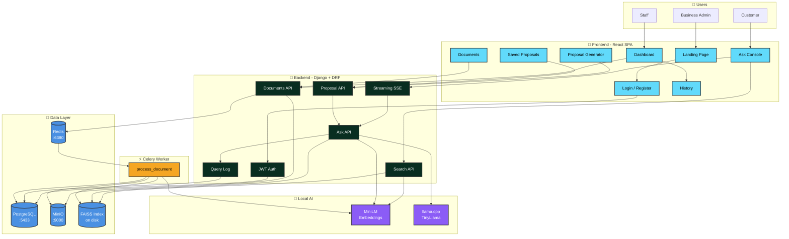

# System Architecture

## Component Responsibilities

| Component | Responsibility |
|---|---|
| **React SPA** | UI, routing, SSE consumption, PDF export |
| **Django API** | Auth, business logic, RAG orchestration, audit logging |
| **Celery Worker** | Async document ingestion (extract → chunk → embed → index) |
| **PostgreSQL** | Users, businesses, documents, chunks, query logs, proposals |
| **Redis** | Celery task broker + result backend |
| **MinIO** | Uploaded file storage (S3-compatible, self-hosted) |
| **FAISS** | Vector index for semantic search (per-tenant filter at query time) |
| **MiniLM** | Query + chunk embeddings (384-dim) |
| **llama.cpp** | Local LLM inference — grounded prompt → streamed answer |